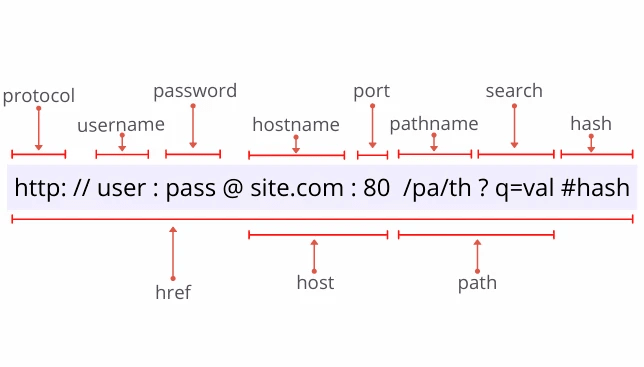

# Что происходит, когда я открываю сайт?

Ты вводишь адрес — например, `wikipedia.org` — и через долю секунды перед тобой появляется страница. Это кажется мгновенным и само собой разумеющимся. Но за эти полсекунды твой компьютер успевает провернуть настоящее чудо из десятков шагов, в которых участвуют устройства по всему миру.

Давай разберём всё по порядку — шаг за шагом.


---

## Весь маршрут за полсекунды

Прежде чем погружаться в детали, вот краткая карта путешествия:

| Шаг | Что происходит | Кто участвует |
|-----|---------------|---------------|
| **1** | Ты вводишь адрес сайта | Ты + браузер |
| **2** | Браузер узнаёт IP-адрес сервера через DNS | Браузер + DNS-серверы |
| **3** | Браузер устанавливает соединение с сервером | TCP/IP через Wi-Fi или кабель |
| **4** | Браузер отправляет запрос по HTTP/HTTPS | Браузер + сервер |
| **5** | Сервер готовит и отправляет ответ | Веб-сервер |
| **6** | Браузер получает HTML и собирает страницу | Браузер |

Теперь разберём каждый шаг подробно.

---

## Шаг 1: Ты вводишь адрес — что такое URL?

Когда ты пишешь `https://ru.wikipedia.org/wiki/Кот`, ты вводишь **URL** (Uniform Resource Locator — единый указатель ресурса). Это точный адрес конкретного документа в интернете. Как почтовый адрес, только для файлов.

URL состоит из нескольких частей:



```
https://ru.wikipedia.org/wiki/Кот
  │          │                │
  │          │                └── Путь: какую именно страницу хочешь
  │          └──────────────────── Домен: имя сервера
  └─────────────────────────────── Протокол: как общаться
```

| Часть URL | Пример | Что означает |
|-----------|--------|-------------|
| Протокол | `https://` | Правила общения (HTTP или HTTPS) |
| Домен | `ru.wikipedia.org` | Имя сервера — понятное людям |
| Путь | `/wiki/Кот` | Конкретная страница на сервере |
| Параметры | `?lang=ru` | Дополнительные настройки (если есть) |

Браузер разбирает URL и понимает: «Мне нужно зайти на сервер `ru.wikipedia.org` по протоколу HTTPS и попросить страницу `/wiki/Кот`».

Но подожди — браузер пока знает только **имя** сервера (`ru.wikipedia.org`). Интернет же работает с **числовыми адресами** (IP-адресами). Откуда взять IP?

---

## Шаг 2: DNS — телефонная книга интернета

Имя сервера вроде `ru.wikipedia.org` — удобно для людей, но компьютеры общаются по **числовым IP-адресам**, например `185.15.58.224`. Нужно перевести имя в число.

Этим занимается **DNS** (Domain Name System — система доменных имён). Это как огромная телефонная книга: ты называешь имя, а книга говорит тебе номер.

Как проходит DNS-запрос:

1. **Браузер спрашивает** у ближайшего DNS-сервера: «Какой IP у `ru.wikipedia.org`?»
2. **DNS-сервер ищет** — сначала в своём кэше (памяти), потом у вышестоящих серверов
3. **DNS-сервер отвечает**: «`185.15.58.224`»
4. Браузер **запоминает** ответ на некоторое время, чтобы не спрашивать снова

Весь этот процесс занимает обычно **несколько миллисекунд**. Если ты заходил на этот сайт недавно — браузер помнит IP и пропускает этот шаг.

> **Знаешь ли ты?** DNS-серверов в мире тысячи. Самые известные публичные — `8.8.8.8` от Google и `1.1.1.1` от Cloudflare. Они бесплатны и отвечают на запросы от кого угодно. Когда дома «пропал интернет», но сеть вроде работает — часто проблема именно в DNS.

Подробнее: [DNS](../dns/README.md) <!-- TODO: статья пишется -->

---

## Шаг 3: Установка соединения — TCP и IP

Теперь браузер знает IP-адрес сервера. Пора «позвонить» ему. Но прежде чем начать разговор, нужно **установить соединение**.

Данные в интернете путешествуют не напрямую — они разбиваются на маленькие кусочки, называемые **пакетами**, и каждый пакет может идти своим маршрутом через разные устройства. Правила этой доставки описывают протоколы **IP** и **TCP**.

**IP** (Internet Protocol) отвечает за адресацию: каждый пакет знает, откуда он и куда. Как адрес на конверте.

**TCP** (Transmission Control Protocol) отвечает за надёжность: гарантирует, что все пакеты дошли и в правильном порядке. Для этого браузер и сервер сначала «пожимают руки» — проводят **TCP-рукопожатие** (handshake):

```
Браузер → Сервер:   «SYN» (хочу соединиться!)
Сервер  → Браузер:  «SYN-ACK» (окей, подключайся!)
Браузер → Сервер:   «ACK» (принято, начинаем!)
```

После этого соединение установлено и можно обмениваться данными.

Кстати — всё это путешествие пакетов начинается с твоей локальной сети. Прежде чем пакет уйдёт в интернет, он проходит через твой роутер по Wi-Fi или кабелю. Каждое устройство в сети имеет свой **MAC-адрес** (физический) и **IP-адрес** (сетевой).

Подробнее:
- [Wi-Fi и локальная сеть](../wifi_lan/README.md) <!-- TODO: статья пишется -->
- [IP и MAC-адреса](../ip_mac/README.md) <!-- TODO: статья пишется -->
- [TCP и UDP](../tcp_udp/README.md) <!-- TODO: статья пишется -->

---

## Шаг 4: HTTP-запрос — «дайте мне страницу»

Соединение установлено. Теперь браузер отправляет **HTTP-запрос** — вежливую просьбу дать нужную страницу. Если используется HTTPS, весь обмен **зашифрован** — никто посторонний не сможет прочитать данные.

Запрос выглядит примерно так:

```
GET /wiki/Кот HTTP/2
Host: ru.wikipedia.org
User-Agent: Mozilla/5.0
Accept-Language: ru
```

Это буквально: «Используя метод GET, прошу страницу `/wiki/Кот`. Я браузер Mozilla, предпочитаю русский язык.»

Сервер получает запрос, находит нужную страницу (или формирует её на лету из базы данных) и отправляет **ответ**:

```
HTTP/2 200 OK
Content-Type: text/html; charset=UTF-8

<!DOCTYPE html>
<html>
  <head><title>Кот — Википедия</title></head>
  <body>...</body>
</html>
```

Код `200 OK` означает: «Всё хорошо, вот твоя страница».

Подробнее: [HTTP и HTTPS](../http_https/http_https.md)

---

## Шаг 5: Браузер собирает страницу

Браузер получил HTML-файл. Но это ещё не готовая страница — это инструкция по её сборке. Теперь браузеру предстоит большая работа.

### Что такое HTML, CSS и JavaScript?

- **HTML** — структура страницы: заголовки, абзацы, ссылки, картинки
- **CSS** — внешний вид: цвета, шрифты, отступы, расположение блоков
- **JavaScript** — поведение: кнопки, анимации, динамические данные

### Как браузер строит страницу

1. **Читает HTML** и строит дерево элементов страницы — **DOM** (Document Object Model)
2. **Загружает CSS** и рассчитывает, как должен выглядеть каждый элемент — строит **CSSOM**
3. **Объединяет** DOM и CSSOM в дерево рендеринга
4. **Рассчитывает позиции** всех элементов на экране (Layout)
5. **Рисует** пиксели на экране (Paint)
6. **Запускает JavaScript** — скрипты могут изменять страницу прямо во время её показа

Часто страница показывает что-то простое уже через 100–200 мс, а дополнительный контент (картинки, видео, реклама) подгружается позже.

> **Знаешь ли ты?** Когда ты открываешь главную страницу Google, браузер делает несколько десятков отдельных запросов: один за HTML, ещё несколько за CSS, JavaScript, логотипом и иконками. Все они идут почти одновременно — HTTP/2 позволяет посылать много запросов по одному соединению.

Подробнее: [Что такое браузер и как он устроен](browser.md)

---

## Шаг 6: А где физически находится сервер?

Пока браузер делал запросы, с другого конца провода отвечал **сервер** — специальный компьютер, который работает круглосуточно и отвечает на миллионы запросов в день. Серверы Википедии стоят в огромных зданиях, называемых **дата-центрами**, которые есть в разных странах мира.

Подробнее: [Что такое сервер и где он находится](server.md)

---

## Всё вместе: хронология за 300 миллисекунд

Вот что происходит, когда ты нажимаешь Enter:

```
0 мс       — Ты нажал Enter
0–5 мс     — Браузер разбирает URL
5–15 мс    — DNS-запрос: имя → IP-адрес
15–80 мс   — TCP-рукопожатие с сервером
80–120 мс  — TLS-рукопожатие (для HTTPS)
120–150 мс — HTTP GET-запрос летит на сервер
150–200 мс — Сервер обрабатывает запрос, отправляет HTML
200–280 мс — Браузер загружает CSS, JS, картинки
280–300 мс — Страница отрисована на экране
```

Всё это — за время, за которое ты успеваешь моргнуть. Неплохо, правда?

---

## Интересные факты

- **Первый сайт в истории** открыл Тим Бернерс-Ли в ЦЕРНе в 1991 году. Его адрес — `http://info.cern.ch` — работает до сих пор.
- **Сегодня в интернете** более 1,5 миллиарда сайтов, хотя активных из них около 200 миллионов.
- **Скорость света** ограничивает, насколько быстро сигнал может добраться до сервера на другом конце Земли. Физически нельзя получить ответ быстрее, чем за ~130 мс от сервера на другом полушарии.
- **CDN** (Content Delivery Network) — сети доставки контента — специально ставят серверы по всему миру, чтобы данные проходили меньший путь и страницы открывались быстрее.
- **Каждую секунду** люди делают около 8 миллионов поисковых запросов в Google.

---

## Читай также

- [Wi-Fi и локальная сеть](../wifi_lan/README.md) — как данные идут от твоего компьютера до роутера и дальше <!-- TODO: статья пишется -->
- [IP и MAC-адреса](../ip_mac/README.md) — адреса устройств в сети <!-- TODO: статья пишется -->
- [TCP и UDP](../tcp_udp/README.md) — как пакеты путешествуют по сети <!-- TODO: статья пишется -->
- [DNS](../dns/README.md) — как имена превращаются в IP-адреса <!-- TODO: статья пишется -->
- [HTTP и HTTPS](../http_https/http_https.md) — правила разговора браузера с сервером
- [Что такое браузер и как он устроен](browser.md) — движки, рендеринг, популярные браузеры
- [Что такое сервер и где он находится](server.md) — железо, дата-центры, веб-серверы

---

Авторы: Арсений Григорян
*Ресурсы: LLM — Claude Sonnet 4.6, WikiData*
