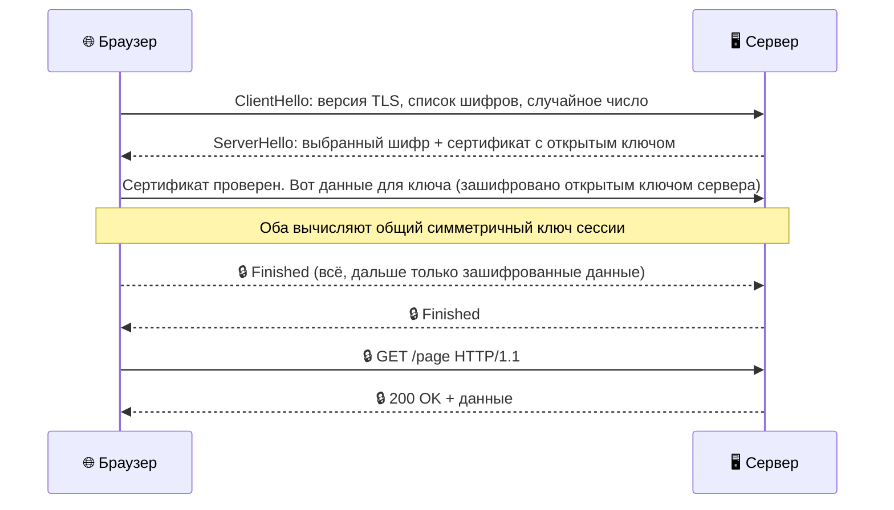

# Что такое TLS и как работает шифрование

Когда ты видишь замочек 🔒 в адресной строке браузера, за этим значком прячется целый механизм защиты. Называется он **TLS** (Transport Layer Security — безопасность транспортного уровня). Именно TLS превращает обычный HTTP в защищённый HTTPS.

---

## История: от SSL к TLS

Всё началось в 1994 году, когда компания Netscape придумала протокол **SSL** (Secure Sockets Layer) для защиты онлайн-покупок. SSL несколько раз обновлялся, но в каждой версии находились уязвимости.

В 1999 году на смену SSL пришёл **TLS** — более надёжный и стандартизированный протокол. Сегодня используются TLS 1.2 и TLS 1.3. Старые версии отключены в современных браузерах как небезопасные.

| Версия | Год | Статус |
|--------|-----|--------|
| SSL 2.0 | 1995 | Запрещён |
| SSL 3.0 | 1996 | Запрещён |
| TLS 1.0 | 1999 | Устарел, отключён |
| TLS 1.1 | 2006 | Устарел, отключён |
| TLS 1.2 | 2008 | Используется |
| TLS 1.3 | 2018 | Рекомендуется ✅ |

> **Почему говорят «SSL-сертификат»?** Историческая привычка — сертификаты называли так с 1990-х. На самом деле сегодня везде используется TLS, но старое название прижилось.

---

## Два вида шифрования

Чтобы понять TLS, нужно разобраться с двумя способами шифрования данных.

### Симметричное шифрование

Один и тот же ключ используется и для шифрования, и для расшифровки.

**Аналогия:** у тебя и у друга одинаковые ключи от одного замка. Ты кладёшь письмо в ящик и запираешь — друг открывает тем же ключом.

**Проблема:** как передать другу этот ключ, чтобы никто не перехватил?

### Асимметричное шифрование

Здесь два ключа: **открытый** (публичный) и **закрытый** (приватный). Открытый ключ можно раздавать кому угодно, закрытый — только у тебя.

**Аналогия:** представь почтовый ящик с щелью. Любой прохожий может опустить туда письмо (использовать открытый ключ), но достать содержимое — только ты своим ключом (закрытый ключ).

Зашифровать данные можно открытым ключом, а расшифровать — только закрытым.

<!--
  ИЗОБРАЖЕНИЕ: Схема симметричного и асимметричного шифрования.
  Два блока рядом:
  Слева — один ключ, стрелка в обе стороны (симметричное).
  Справа — замок с щелью (открытый ключ) и отдельный ключ (закрытый).
  Файл: ../images/encryption_types.png
-->

---

## TLS-рукопожатие: как договариваются браузер и сервер

TLS умно использует оба вида шифрования:
- **Асимметричное** — чтобы безопасно передать ключ в начале
- **Симметричное** — для всей дальнейшей передачи данных (оно намного быстрее)

Вот как выглядит рукопожатие TLS 1.3:

Весь этот процесс занимает **миллисекунды** — ты его даже не замечаешь.

> **Знаешь ли ты?** TLS 1.3 вдвое быстрее TLS 1.2, потому что рукопожатие теперь занимает один «туда-обратно» вместо двух. При повторном подключении к знакомому серверу можно отправить данные ещё быстрее — с «нулевым» рукопожатием (0-RTT).

---

## Цифровые сертификаты

Асимметричное шифрование решает проблему передачи ключей. Но остаётся другой вопрос: **а вдруг мошенник прикинется нужным сервером** и пришлёт свой открытый ключ?

Именно для этого существуют **цифровые сертификаты**.

### Что содержит сертификат

- Доменное имя сайта (`example.com`)
- Открытый ключ сервера
- Срок действия (обычно 1 год)
- Цифровая подпись удостоверяющего центра

### Удостоверяющий центр (CA)

**CA (Certificate Authority)** — это организация, которой все доверяют. CA проверяет, что владелец сертификата действительно контролирует домен, и ставит свою цифровую подпись.

В каждый браузер встроен список доверенных CA (их около 150). Получив сертификат, браузер проверяет подпись — если она от доверенного CA, значит сервер настоящий.

Если что-то не так (сертификат истёк, подпись не та, домен не совпадает) — браузер показывает красное предупреждение.

> **Знаешь ли ты?** Крупнейший бесплатный CA — **Let's Encrypt** — выдал уже более 3 миллиардов сертификатов. Именно благодаря ему большинство сайтов перешло на HTTPS — раньше сертификат стоил денег.

---

## Что TLS защищает — и от чего не защищает

**TLS защищает:**
- Данные от перехвата в сети — пароли, сообщения, банковские данные
- От подмены сервера («атака человека посередине»)

**TLS не защищает:**
- От вирусов и вредоносных программ на твоём компьютере
- От мошеннических сайтов — замочек означает только шифрование, а не честность сайта
- От утечек данных на самом сервере

> **Важно:** мошеннические сайты тоже могут иметь HTTPS и замочек. Перед вводом паролей проверяй не только замочек, но и адрес сайта целиком.

---

## Интересные факты

- **Название «рукопожатие»** (handshake) — отсылка к деловому приветствию: стороны «пожимают руки» перед началом разговора.
- **Квантовые компьютеры** теоретически смогут взломать нынешнее асимметричное шифрование за обозримое время. Поэтому уже разрабатываются **постквантовые алгоритмы** шифрования.
- **HTTPS в Chrome** — с 2018 года Chrome помечает все HTTP-сайты как «Небезопасные». Это резко ускорило переход интернета на HTTPS.

---

Авторы: Коростин Никита
*Ресурсы: LLM — Claude Sonnet 4.6*
