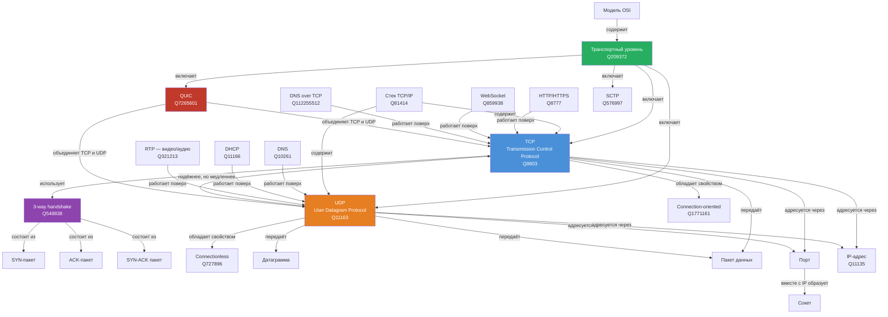
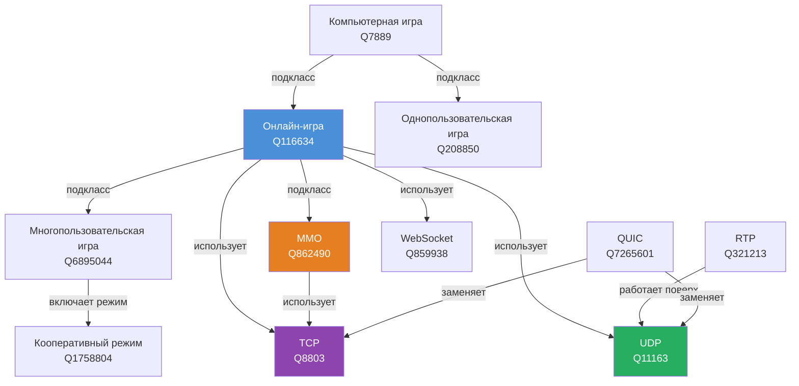

# Отчёт по разделу «Сети и интернет»

## Команда

| Участник | GitHub | Статьи |
|----------|--------|--------|
| oguzok2012 | @oguzok2012 | TCP и UDP, Как работает онлайн-игра изнутри |
| Никита | — | HTTP и HTTPS |
| *участник 3* | — | *—* |
| *участник 4* | — | *—* |
| *участник 5* | — | *—* |

---

## Структура раздела

| Статья | Автор | Статус |
|--------|-------|--------|
| [Что происходит, когда я открываю сайт?](../../KIDBOOK/networks/what_happens/README.md) | — | 🚧 |
| [История интернета](../../KIDBOOK/networks/internet_history/README.md) | — | 🚧 |
| [Wi-Fi и локальная сеть](../../KIDBOOK/networks/wifi_lan/README.md) | — | 🚧 |
| [IP и MAC-адреса](../../KIDBOOK/networks/ip_mac/README.md) | — | 🚧 |
| [TCP и UDP](../../KIDBOOK/networks/tcp_udp/tcp_udp.md) | oguzok2012 | ✅ |
| [Как работает онлайн-игра изнутри](../../KIDBOOK/networks/online_game/online_game.md) | oguzok2012 | 🚧 |
| [DNS](../../KIDBOOK/networks/dns/README.md) | — | 🚧 |
| [HTTP и HTTPS](../../KIDBOOK/networks/http_https/http_https.md) | Никита | ✅ |

---

## Онтология

### TCP и UDP — граф понятий (oguzok2012)



### Онлайн-игры — граф понятий (oguzok2012)



### Список всех понятий раздела

| Понятие | WikiData ID | Автор | Статья |
|---------|-------------|-------|--------|
| TCP | Q8803 | oguzok2012 | tcp_udp |
| UDP | Q11163 | oguzok2012 | tcp_udp |
| Транспортный уровень | Q209372 | oguzok2012 | tcp_udp |
| Модель OSI | Q83418 | oguzok2012 | tcp_udp |
| Стек TCP/IP | Q81414 | oguzok2012 | tcp_udp |
| 3-way handshake | Q548838 | oguzok2012 | tcp_udp |
| Connection-oriented | Q1771161 | oguzok2012 | tcp_udp |
| Connectionless | Q727896 | oguzok2012 | tcp_udp |
| WebSocket | Q859938 | oguzok2012 | tcp_udp / online_game |
| RTP | Q321213 | oguzok2012 | tcp_udp / online_game |
| QUIC | Q7265601 | oguzok2012 | tcp_udp / online_game |
| Онлайн-игра | Q116634 | oguzok2012 | online_game |
| Многопользовательская игра | Q6895044 | oguzok2012 | online_game |
| MMO | Q862490 | oguzok2012 | online_game |
| Кооперативный режим | Q1758804 | oguzok2012 | online_game |
| Компьютерная игра | Q7889 | oguzok2012 | online_game |
| HTTP/HTTPS | Q8777 | Никита | http_https |
| TLS/SSL | Q193143 | Никита | http_https |
| Cookies | Q483326 | Никита | http_https |
| *понятие* | *—* | *участник 3* | *—* |
| *понятие* | *—* | *участник 4* | *—* |
| *понятие* | *—* | *участник 5* | *—* |

---

## Источники знаний

### oguzok2012 — TCP и UDP + Онлайн-игры

#### Запрос 1: базовая информация о TCP и UDP
```sparql
SELECT ?item ?itemLabel ?itemDescription
WHERE {
  VALUES ?item { wd:Q8803 wd:Q11163 }
  SERVICE wikibase:label {
    bd:serviceParam wikibase:language "ru,en"
  }
}
```

#### Запрос 2: все свойства TCP
```sparql
SELECT ?prop ?propLabel ?value ?valueLabel
WHERE {
  wd:Q8803 ?p ?value .
  ?prop wikibase:directClaim ?p .
  SERVICE wikibase:label {
    bd:serviceParam wikibase:language "ru,en"
  }
}
LIMIT 40
```

#### Запрос 3: подклассы компьютерной игры
```sparql
SELECT DISTINCT ?item ?itemLabel ?itemDescription
WHERE {
  {
    ?item wdt:P279 wd:Q7889 .
  }
  UNION
  {
    wd:Q7889 wdt:P279 ?item .
  }
  SERVICE wikibase:label {
    bd:serviceParam wikibase:language "ru,en"
  }
}
LIMIT 30
```

#### Запрос 4: что работает поверх TCP и UDP
```sparql
SELECT DISTINCT ?app ?appLabel ?appDescription ?transport ?transportLabel
WHERE {
  {
    { ?app wdt:P2283 wd:Q8803 . BIND(wd:Q8803 AS ?transport) }
    UNION
    { ?app wdt:P2283 wd:Q11163 . BIND(wd:Q11163 AS ?transport) }
  }
  SERVICE wikibase:label {
    bd:serviceParam wikibase:language "ru,en"
  }
}
LIMIT 30
```

#### Запрос 5: подклассы и технологии онлайн-игры
```sparql
SELECT DISTINCT ?item ?itemLabel ?itemDescription
WHERE {
  {
    ?item wdt:P279* wd:Q116634 .
  }
  UNION
  {
    wd:Q116634 wdt:P361 ?item .
  }
  UNION
  {
    wd:Q116634 wdt:P2283 ?item .
  }
  SERVICE wikibase:label {
    bd:serviceParam wikibase:language "ru,en"
  }
}
LIMIT 25
```

#### Запрос 6: онлайн/многопользовательские режимы
```sparql
SELECT DISTINCT ?item ?itemLabel ?itemDescription
WHERE {
  {
    ?item wdt:P279 wd:Q7889 .
    ?item rdfs:label ?label .
    FILTER(LANG(?label) = "ru")
    FILTER(CONTAINS(LCASE(?label), "онлайн") || CONTAINS(LCASE(?label), "многопользовател") || CONTAINS(LCASE(?label), "сетев") || CONTAINS(LCASE(?label), "multiplayer"))
  }
  UNION
  {
    VALUES ?item { wd:Q862490 wd:Q208850 wd:Q1758804 wd:Q16070115 }
  }
  SERVICE wikibase:label {
    bd:serviceParam wikibase:language "ru,en"
  }
}
```

#### Запрос 7: финальный сбор всех ключевых понятий
```sparql
SELECT DISTINCT ?item ?itemLabel ?itemDescription
WHERE {
  VALUES ?item { 
    wd:Q116634 wd:Q862490 wd:Q6895044 wd:Q208850 
    wd:Q1758804 wd:Q859938 wd:Q8803 wd:Q11163 
    wd:Q7265601 wd:Q321213 wd:Q7889
  }
  SERVICE wikibase:label {
    bd:serviceParam wikibase:language "ru,en"
  }
}
```

#### Ключевые факты из WikiData

```json
{
  "tcp": {
    "wikidata_id": "Q8803",
    "rfc": ["793", "1323", "7323", "9293"],
    "osi_layer": "транспортный (Q209372)",
    "property": "connection-oriented (Q1771161)",
    "uses": ["IP (Q8795)", "Ethernet (Q79984)", "handshaking (Q548838)"],
    "part_of": "TCP/IP (Q81414)",
    "apps_on_top": ["HTTP (Q8777)", "WebSocket (Q859938)", "DNS over TCP (Q112255512)"]
  },
  "udp": {
    "wikidata_id": "Q11163",
    "rfc": ["768"],
    "date": "1980-01-01",
    "osi_layer": "транспортный (Q209372)",
    "property": "connectionless (Q727896)",
    "uses": ["IPv4 (Q11103)", "IPv6 (Q2551624)"],
    "part_of": "TCP/IP (Q81414)",
    "apps_on_top": ["DHCP (Q11166)", "RTP (Q321213)", "DNS (Q10261)"]
  },
  "online_game": {
    "wikidata_id": "Q116634",
    "subclasses": ["MMO (Q862490)", "многопользовательская игра (Q6895044)"],
    "related": ["WebSocket (Q859938)", "RTP (Q321213)", "QUIC (Q7265601)", "UDP (Q11163)", "TCP (Q8803)"]
  }
}
```

### Никита — HTTP и HTTPS

*Описание процесса и SPARQL-запросы будут добавлены*

### *Участник 3*

*Описание процесса и SPARQL-запросы будут добавлены*

### *Участник 4*

*Описание процесса и SPARQL-запросы будут добавлены*

### *Участник 5*

*Описание процесса и SPARQL-запросы будут добавлены*

---

## Процесс генерации статей

### oguzok2012 — TCP и UDP

**Инструменты:** WikiData (SPARQL), Claude 4.5 Opus

**Промпт:**
```
Факты из WikiData для использования в статье:

TCP (Q8803):
- RFC 793 (1981), RFC 9293 — актуальный стандарт
- Свойство: connection-oriented — перед передачей устанавливается соединение
- Использует: handshaking (3-way handshake)
- Поверх TCP работают: HTTP, WebSocket, DNS over TCP

UDP (Q11163):
- RFC 768 (1980)
- Свойство: connectionless — соединение не устанавливается
- Поверх UDP работают: DHCP, RTP (видео/аудио)
- Дата публикации: 1 января 1980

Оба протокола:
- Транспортный уровень модели OSI (Q209372)
- Часть стека TCP/IP (Q81414)
- Соседи по уровню: QUIC (Q7265601), SCTP, RTP

Объясни для десятилетнего ребёнка что такое протоколы TCP и UDP.
Формат: GitHub Flavored Markdown, аналогии из реальной жизни.
```

### Никита — HTTP и HTTPS

*Промпт и описание процесса будут добавлены*

### *Участник 3*

*Промпт и описание процесса будут добавлены*
